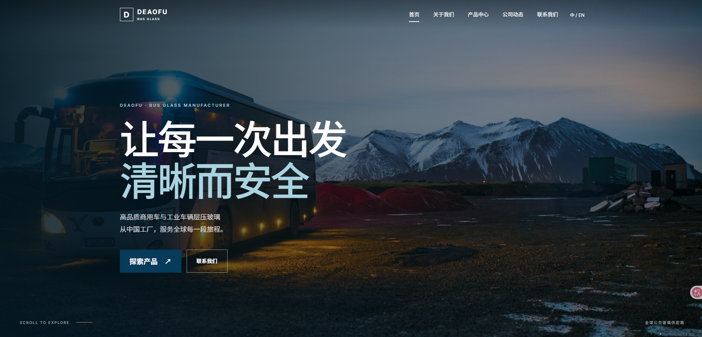
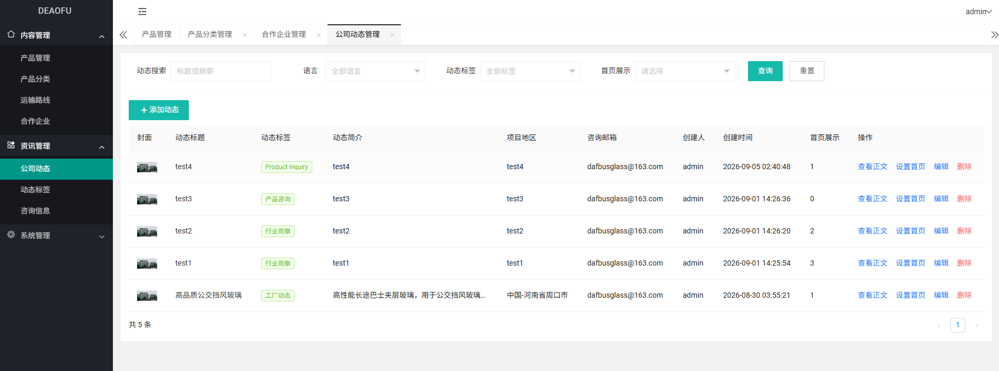

# DEAOFU 后端 🚍

德奥福（DEAOFU）汽车玻璃有限公司官方网站与企业业务后台，面向商用车、工业车辆玻璃及汽车配件业务场景，提供官网内容展示和管理端内容维护能力。

> 🚧 项目当前仍在持续完善中。后端核心接口、管理页面和官网模板已逐步接入，部分业务能力与视觉细节会继续迭代。

## 项目能力

具有国际化能力，支持中英文切换

### 官网前台 🌐

- 首页：展示企业信息、重点产品、公司动态和合作企业。
- 关于我们：展示企业介绍、厂区环境和资质信息。
- 产品中心：按分类浏览产品，并查看产品详情与参数。
- 公司动态：查看动态列表、标签和动态详情。
- 联系我们：提交咨询信息，支持后台统一查看和处理。

### 管理后台 🛠️

- Session 登录、退出登录和当前用户信息查询。
- 产品分类维护，支持一级分类和二级分类。
- 产品内容维护，包括封面、详情图片、简介、参数和首页展示顺序。
- 运输线路维护，用于管理源地址和目标地址。
- 合作企业及客户 Logo 管理。
- 公司动态、动态标签和标签图标管理。
- 咨询消息分页、详情、查看状态和删除。
- 文件上传、预览与删除，文件二进制直接存储在数据库。
- 管理端用户查询、编辑、密码维护和逻辑删除。

## 技术栈 🔧

| 类型 | 技术 |
| --- | --- |
| 运行环境 | JDK 17+ |
| Web 框架 | Spring Boot 3.3.5 / Spring MVC |
| 持久层 | MyBatis-Plus 3.5.9 / MySQL 8+ |
| 页面渲染 | Thymeleaf |
| 参数校验 | Jakarta Bean Validation |
| 工具库 | Hutool 5.8.32 / Gson 2.11.0 |
| 工程辅助 | Maven / Lombok 1.18.34 |
| 前端资源 | 原生 HTML、CSS、JavaScript / Layui / GSAP |

## 前端界面 🎨

官网前台首页



管理后台



## 快速开始 🚀

### 1. 准备环境

- JDK 17 或更高版本
- Maven 3.8+
- MySQL 8.0+

### 2. 创建数据库

创建 `deaofu` 数据库，并使用 `utf8mb4` 字符集：

```sql
CREATE DATABASE deaofu DEFAULT CHARACTER SET utf8mb4 COLLATE utf8mb4_unicode_ci;
```

然后按文件名时间顺序执行 `db/` 目录下的 SQL 脚本：

1. `20260824000100_file_storage_and_user.sql`
2. `20260825165300_insert_sys_user.sql`
3. `20260825230000_admin_content.sql`
4. `20260901000100_home_show_order.sql`
5. `20260902000000_consultation_view_status.sql`
6. `20260905000100_content_language.sql`

`20260825165300_insert_sys_user.sql` 会写入初始管理员记录。请在本地部署后及时修改管理员密码，不要将真实凭证提交到仓库或公开文档中。

### 3. 配置数据库连接

默认配置位于 `src/main/resources/application.yml`，支持通过环境变量覆盖：

| 环境变量 | 默认值 | 说明 |
| --- | --- | --- |
| `DB_URL` | `jdbc:mysql://localhost:3306/deaofu...` | MySQL JDBC 连接串 |
| `DB_USERNAME` | `root` | 数据库用户名 |
| `DB_PASSWORD` | 留在本地配置 | 数据库密码 |
| `SERVER_PORT` | `8080` | 服务端口 |
| `FILE_MAX_SIZE` | `100MB` | 单文件上传大小 |
| `FILE_MAX_REQUEST_SIZE` | `110MB` | 单次请求大小 |

示例（请替换为自己的连接信息）：

```bash
export DB_URL="jdbc:mysql://127.0.0.1:3306/deaofu?useUnicode=true&characterEncoding=utf8&serverTimezone=Asia/Shanghai&useSSL=false&allowPublicKeyRetrieval=true&useInformationSchema=true"
export DB_USERNAME="deaofu_user"
export DB_PASSWORD="your-password"
export SERVER_PORT="8080"
```

### 4. 启动项目

在项目根目录执行：

```bash
mvn spring-boot:run
```

启动成功后访问：

```text
http://localhost:8080
```

后台入口为 `/admin/login`。管理端接口和需要登录的页面使用 HTTP Session 进行身份校验；官网前台无需登录。

### 5. 登录账号

```json
{
    "username": "admin",
    "password": "ax./sx762"
}
```

## 核心目录 📁

```text
deaofu/
├── db/                              # 数据库表结构与初始化脚本
├── prototype/                       # 官网与管理后台原型资源
├── src/main/java/com/deaofu/
│   ├── common/                      # 统一响应、分页、基础对象
│   ├── config/                      # Web、跨域、MyBatis-Plus 等配置
│   ├── controller/admin/            # 管理端页面与 REST 接口
│   ├── controller/portal/           # 官网页面与公开接口
│   ├── mapper/                      # MyBatis-Plus Mapper
│   ├── model/{dto,entity,vo}/       # 入参、实体、出参模型
│   ├── service/                     # 业务接口与实现
│   └── utils/                       # 通用工具类
└── src/main/resources/
    ├── templates/{admin,portal}/    # Thymeleaf 页面模板
    ├── static/{admin,portal}/       # CSS、JavaScript、图片等静态资源
    └── application.yml              # 应用与数据源配置
```

## 数据与安全说明 🔐

- 管理端使用 Session 保存登录用户信息，未登录访问受保护资源时由统一拦截器处理。
- 用户密码以 BCrypt 哈希形式保存，业务代码不保存明文密码。
- `sys_file.file_data` 使用数据库 `longblob` 保存文件二进制内容，不在应用服务器落盘。
- 生产环境请使用独立数据库账号、强密码和环境变量管理敏感配置，并限制文件上传大小与访问权限。

